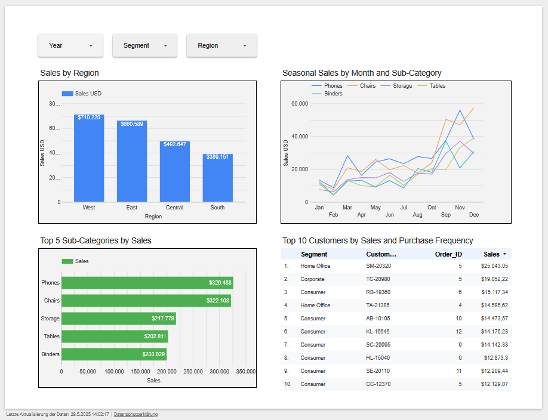

# Superstore Sales Analysis
Portfolio project with comprehensive analyisis of Superstore sales data  using Jupyter notebooks, Bigquery SQL queries, and Looker Studio dashboards.

## Overview

This portfolio project analyzes Superstore sales data from **2015 to 2018**, showcasing skills in:

- Data cleaning
- SQL querying
- Python-based exploratory data analysis (EDA)
- Interactive visualization

Using **Google BigQuery**, **Jupyter Notebook**, and **Looker Studio**, it explores:

- Trends in sales
- Customer segments
- Regional performance
- Seasonal patterns

The dashboard includes interactive filters for **Year**, **Segment**, and **Region**.

## Data Source

- **Dataset:** Superstore sales dataset, cleaned and stored as `superstore_cleaned.csv`
- **Time Period:** January 1, 2015 – December 30, 2018
- **Key Metrics:**  
  - Total Sales  
  - Average Order Value  
  - Sales by Category, Region, Sub-Category  
  - Customer Purchase Frequency

## Steps

### 1. Data Exploration
- Explored key columns in Jupyter Notebook: `Order_ID`, `Order_Date`, `Sales`, `Category`, `Region`.

### 2. Data Preview
- Initial analysis of key metrics (e.g., **Total Sales ~ $2.25M**, **Phones ~ $326,488**).

### 3. Quality Check
- Fixed 11 missing `Postal_Code` values
- Converted `Order_Date` and `Ship_Date` to datetime
- Converted `Postal_Code` to string

### 4. EDA in Jupyter Notebook

- **Top 5 Sub-Categories by Sales:** Phones (~$326,488), Chairs (~$322,108)
- **Sales by Year (2015–2018)**
  
### 5. Data Cleaning
- Created `superstore_cleaned.csv` (9,789 rows) using Jupyter Notebook for BigQuery analysis

### 6. SQL Analysis
- Used BigQuery for KPIs and trends:
  - Total Sales
  - Average Order Value (AOV)
  - Sales Share
  - Seasonal patterns
  - Customer behavior

### 7. Visualization in Looker Studio

- **Scorecards:** Total Sales, AOV
- **Geochart:** Sales by State
- **Stacked Bar Chart:** Sales by Category and Year
- **Pie Chart:** Sales Share by Category  
- **Donut Chart:** Segment Distribution (e.g., Consumer ~50.9%)  
- **Bar Charts:** Sales by Category, Sales by Region  
- **Horizontal Bar Chart:** Top 5 Sub-Categories by Sales  
- **Line Chart:** Seasonal Patterns by Month  
- **Tables:**  Top 10 Customers by Sales

## Visualizations

### Looker Studio

- **Overview Dashboard**: Key metrics and high-level sales trends.
 

- **Detailed Insights Dashboard**: In-depth trends and customer insights.

### Jupyter Notebook

- **Top 5 Sub-Categories by Sales**  

- **Top 5 Products by Sales**    

## Files
- [data/superstore_cleaned.csv](data/superstore_cleaned.csv): Cleaned Dataset (CSV)
- [notebooks/superstore_analysis.ipynb](notebooks/superstore_analysis.ipynb): Jupyter Notebook for EDA 
- [sql/superstore_analysis.sql](sql/superstore_analysis.sql): BigQuery SQL Queries (SQL)
- [docs/dashboard_overview.PNG](docs/dashboard_overview.PNG): Looker Studio Overview Screenshot (PNG)
- [docs/dashboard_detailed_insights.PNG](docs/dashboard_detailed_insights.PNG): Looker Studio Detailed View Screenshot (PNG)
- [docs/superstore_dashboard.pdf](docs/superstore_dashboard.pdf): Looker Studio Dashboard (PDF)
- [docs/jupyter_plot_top_subcategories.PNG](docs/jupyter_plot_top_subcategories.PNG): Jupyter Plot Top Sub-Categories
- [docs/jupyter_plot_top_products.PNG][docs/jupyter_plot_top_products.PNG): Jupyter Plot Top Products Screenshot (PNG)

## Interactive Report

Explore the interactive Looker Studio dashboard:  
**[https://lookerstudio.google.com/reporting/24a4bb1e-c5a7-4a8a-a6e9-cbf9fb18817a ]**

## Tools Used

- **Google BigQuery:** SQL querying & data processing
- **Jupyter Notebook:** Python-based data cleaning and EDA
- **Looker Studio:** Dashboard creation
- **Python Libraries:** `pandas`, `matplotlib`, `seaborn`
- **GitHub:** Version control and documentation

## Learnings

- Advanced SQL for KPI computation and trend analysis
- Data cleaning & preprocessing with Python
- Designing user-friendly dashboards in Looker Studio
- Integrating BigQuery, Jupyter, and Looker for end-to-end analysis

## Contact
Reach out via [LinkedIn]( www.linkedin.com/in/roxana-schwartz-rls) or [email](mailto:roxana@rschwartz.de)

